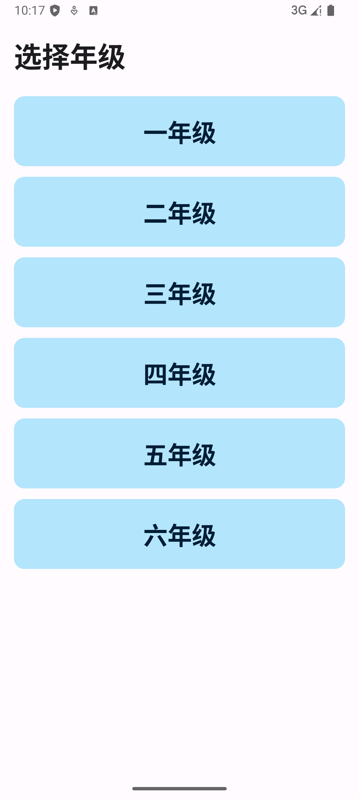
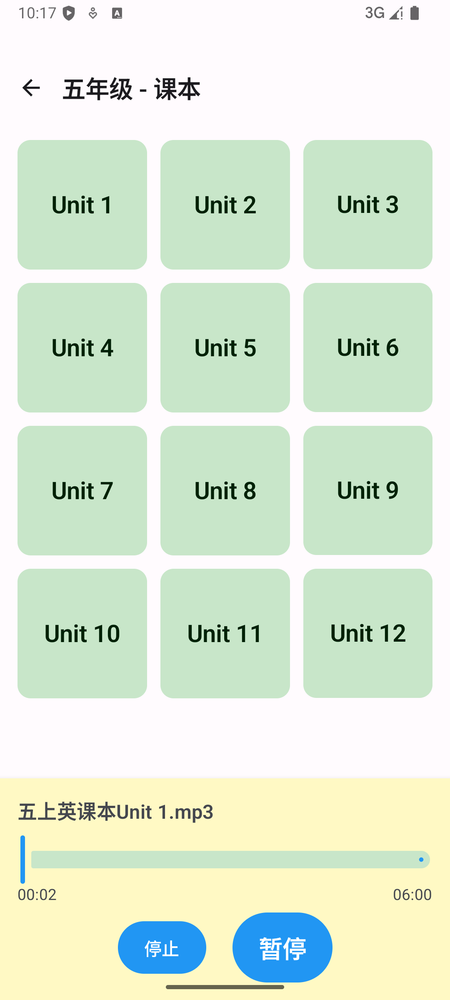

# 英语音频学习 (English Audio Player)

📱 一款专为小学生设计的英语音频学习 Android 应用

## 📖 项目简介

英语音频学习是一款专为中国小学生（1-6年级）设计的英语听力学习应用。应用提供课本和单词两种学习模式，帮助孩子通过音频学习提高英语听力和发音能力。

## 截图






## 安装


链接: <https://pan.baidu.com/s/1hjvHDnAHsCuQhaC5K1LMeQ> 提取码:3kxq

### ✨ 核心特性

- 🎯 **年级选择** - 支持一至六年级，精准匹配学习内容
- 📚 **双模式学习** - 课本朗读和单词发音两种学习方式
- 🎵 **音频播放** - 流畅的音频播放体验，支持播放/暂停/进度控制
- 🎨 **儿童友好界面** - 大按钮、清晰文字、简洁导航
- 📱 **Material Design 3** - 现代化的 UI 设计
- ♿ **无障碍支持** - 完整的 TalkBack 和语义标签支持

## 🏗️ 技术架构

### 架构模式

采用 **Clean Architecture** 分层架构：

```
Presentation Layer (UI)
  - Jetpack Compose
  - ViewModels
  - Navigation
        ↓
Domain Layer (Business Logic)
  - Use Cases
  - Domain Models
        ↓
Data Layer
  - Repository
  - Data Sources
  - Data Models
```

### 技术栈

- **UI Framework**: Jetpack Compose
- **架构组件**: ViewModel, StateFlow, Navigation
- **音频播放**: Android MediaPlayer
- **依赖注入**: 手动 DI (ViewModelFactory)
- **测试**: JUnit, MockK, Coroutines Test
- **语言**: Kotlin 2.0.21
- **最低 SDK**: Android 7.0 (API 24)
- **目标 SDK**: Android 14 (API 36)

## 📁 项目结构

```
EnglishAudio_Android/
├── app/
│   └── src/
│       ├── main/
│       │   ├── java/com/iosdevlog/englishaudio/
│       │   │   ├── data/              # 数据层
│       │   │   ├── domain/            # 领域层
│       │   │   ├── presentation/      # 表现层
│       │   │   ├── service/           # 服务层
│       │   │   ├── ui/theme/          # UI 主题
│       │   │   └── util/              # 工具类
│       │   ├── res/                   # 资源文件
│       │   └── assets/                # 音频文件
│       └── test/                      # 单元测试
└── .kiro/specs/                       # 项目规格文档
```

## � y快速开始

### 环境要求

- Android Studio Hedgehog (2023.1.1) 或更高版本
- JDK 11 或更高版本
- Android SDK API 24+
- Gradle 8.13.0

### 安装步骤

1. **克隆项目**
```bash
git clone https://github.com/build-your-own-x-with-ai/EnglishAudio.git
cd EnglishAudio/EnglishAudio_Android
```

2. **准备音频文件**

将音频文件放置在 `app/src/main/assets/` 目录下，按以下结构组织：

```
assets/
├── 一年级上册课本/
│   ├── 一上英课本unit 1.mp3
│   └── ...
├── 一年级上册单词/
│   ├── 【单词】一年级上册Unit 1.mp3
│   └── ...
└── ...
```

3. **构建项目**
```bash
./gradlew assembleDebug
```

4. **运行测试**
```bash
./gradlew test
```

5. **安装到设备**
```bash
./gradlew installDebug
```

## 🎮 使用说明

### 基本流程

1. **选择年级** - 在首页选择学生所在年级（一至六年级）
2. **选择类型** - 选择"课本"或"单词"学习模式
3. **选择单元** - 从单元列表中选择要学习的单元
4. **播放音频** - 点击单元卡片开始播放音频
5. **控制播放** - 使用底部播放栏控制播放/暂停/进度

### 音频文件命名规范

- **课本音频**: `{年级}上英课本unit {单元号}.mp3`
- **单词音频**: `【单词】{年级}年级上册Unit {单元号}.mp3`

示例：
- `一上英课本unit 1.mp3`
- `【单词】三年级上册Unit 5.mp3`

## 🧪 测试

项目包含完整的单元测试覆盖：

```bash
# 运行所有测试
./gradlew test

# 运行特定测试
./gradlew test --tests "LocalAudioDataSourceTest"

# 查看测试报告
open app/build/reports/tests/testDebugUnitTest/index.html
```

### 测试覆盖

- ✅ LocalAudioDataSource - 文件名解析和加载逻辑
- ✅ AudioRepository - 数据过滤、缓存和错误处理
- ✅ ViewModels - 状态管理和业务逻辑

## 📐 架构设计

### 数据流

```
User Action → ViewModel → Use Case → Repository → Data Source
                ↓
            StateFlow
                ↓
          UI (Compose)
```

### 核心组件

#### 1. 数据层 (Data Layer)
- LocalAudioDataSource: 从 assets 加载音频文件
- AudioRepository: 管理音频数据，提供缓存机制

#### 2. 领域层 (Domain Layer)
- Use Cases: GetGradesUseCase, GetCategoriesUseCase, GetUnitsUseCase
- PlaybackState: 播放状态管理

#### 3. 表现层 (Presentation Layer)
- Screens: GradeSelectionScreen, CategorySelectionScreen, UnitGridScreen
- ViewModels: 管理 UI 状态和业务逻辑

#### 4. 服务层 (Service Layer)
- AudioPlayerService: 音频播放控制和状态管理

## 🎨 UI/UX 设计

### 设计原则

- **简洁直观** - 大按钮、清晰文字、简单导航
- **儿童友好** - 明亮色彩、友好图标、易于理解
- **无障碍** - 完整的语义标签和 TalkBack 支持
- **响应式** - 适配不同屏幕尺寸

### 主题配色

- **Primary**: 蓝色系 (#4A90E2)
- **Secondary**: 紫色系 (#7B68EE)
- **Accent**: 金色 (#FFD700)

## 🔧 配置说明

### Gradle 配置

```kotlin
android {
    compileSdk = 36
    defaultConfig {
        minSdk = 24
        targetSdk = 36
    }
}
```

### 依赖版本

- Kotlin: 2.0.21
- Compose BOM: 2024.09.00
- Coroutines: 1.9.0
- Navigation: 2.8.5
- Lifecycle: 2.9.4

## 📝 开发规范

### 代码风格

- 遵循 Kotlin 官方编码规范
- 使用有意义的变量和函数命名
- 添加必要的注释和文档

### Git 提交规范

```
feat: 新功能
fix: 修复 bug
docs: 文档更新
style: 代码格式调整
refactor: 重构
test: 测试相关
chore: 构建/工具相关
```

## 🗺️ 路线图

- [ ] 添加收藏功能
- [ ] 支持播放列表
- [ ] 添加学习进度跟踪
- [ ] 支持离线下载
- [ ] 添加学习统计

## 🤝 贡献指南

欢迎贡献代码！请遵循以下步骤：

1. Fork 本项目
2. 创建特性分支 (`git checkout -b feature/AmazingFeature`)
3. 提交更改 (`git commit -m 'Add some AmazingFeature'`)
4. 推送到分支 (`git push origin feature/AmazingFeature`)
5. 开启 Pull Request

## 📄 许可证

本项目采用 MIT 许可证

## 👥 作者

**iOSDevLog** - [GitHub](https://github.com/iOSDevLog)

## 🙏 致谢

- 感谢所有贡献者
- 感谢 Android 和 Jetpack Compose 团队
- 感谢开源社区

---

Made with ❤️ for Chinese elementary students learning English
